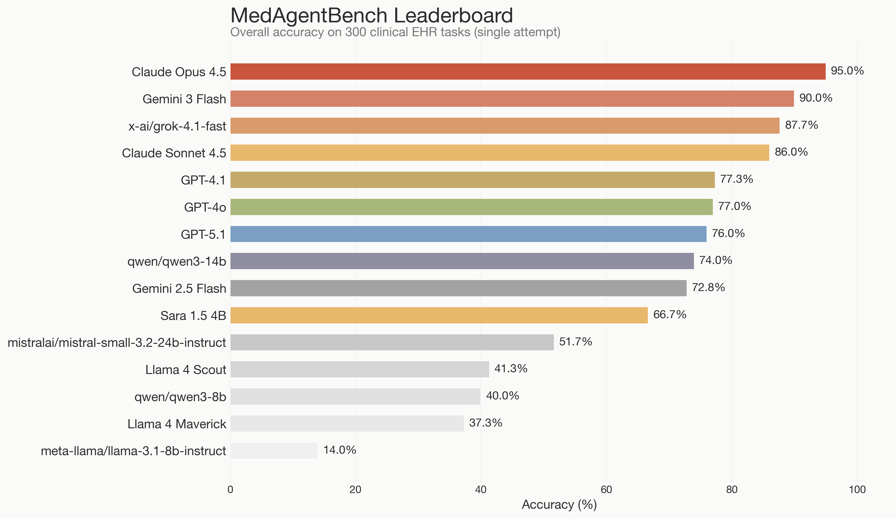
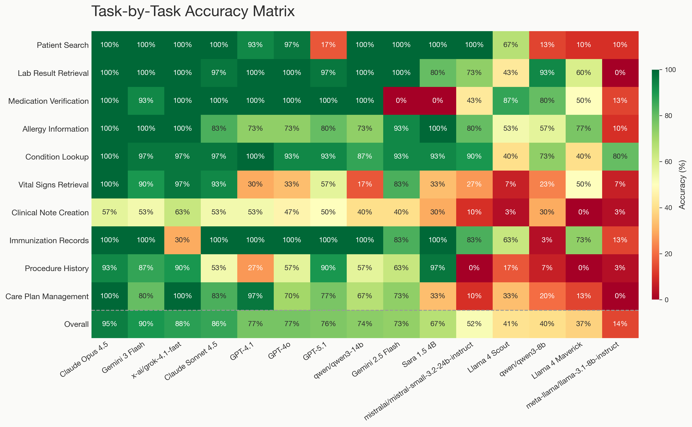
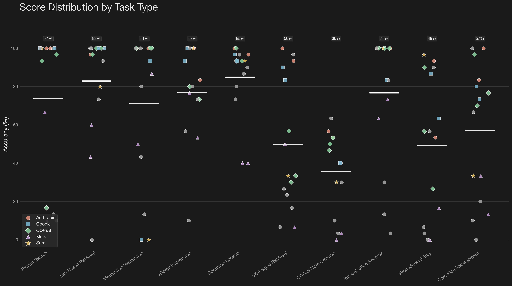
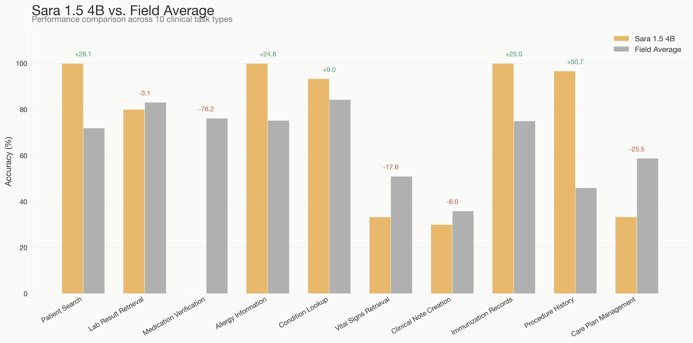
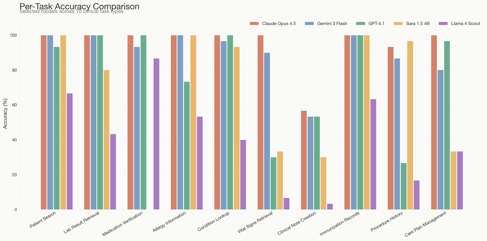

# MedAgentBench: Benchmarking LLM Agents on Clinical EHR Tasks

## 1. Introduction

Electronic health record (EHR) systems are the backbone of modern healthcare, yet physicians spend roughly 73% of their clinical time on documentation and administrative tasks rather than direct patient care. Large language model (LLM) agents that can autonomously interact with EHR systems through standardized APIs could significantly reduce this burden. However, measuring how well these models perform in realistic clinical environments has remained an open challenge.

MedAgentBench, introduced by Jiang et al. (2025) at Stanford, addresses this gap. It provides a standardized benchmark of 300 clinically derived tasks operating against a FHIR R4-compliant server populated with realistic patient data. Each task requires the LLM agent to interact with the EHR through real HTTP requests (GET to retrieve data, POST to create records) and return structured answers, mirroring the workflows found in production EMR systems.

This report presents benchmark results for 15 LLMs evaluated on MedAgentBench under a single-attempt (pass@1) protocol, reflecting the low error tolerance required in healthcare settings. We give special attention to Sara 1.5 4B, a fine-tuned 4-billion parameter model that demonstrates surprisingly strong performance against models 25x to 100x its size.

## 2. Benchmark Overview

### 2.1 Task Environment

The benchmark operates against a Docker-hosted FHIR R4 server containing realistic profiles of 100 patients derived from Stanford's deidentified clinical data warehouse. The dataset includes over 700,000 records spanning lab results, vital signs, procedures, diagnoses, medication orders, and more.

Agents interact with the EHR through three action types:

- **GET requests** to retrieve patient data (e.g., `GET /Patient?name=John&birthdate=1990-01-01`)
- **POST requests** to create clinical records (e.g., `POST /MedicationRequest` with a JSON payload)
- **FINISH** to submit a final answer (e.g., `FINISH([42])`)

Each agent is allowed up to 8 rounds of interaction per task. Evaluation follows pass@1, meaning a single attempt with no retries.

### 2.2 FHIR R4 API Endpoints

The following FHIR resources are available to agents:

| Operation | Resource | Description |
|-----------|----------|-------------|
| GET | Patient | Search patients by name, DOB, MRN, gender |
| GET | Observation (Labs) | Retrieve lab results by code, patient, date range |
| GET | Observation (Vitals) | Retrieve vital signs by flowsheet ID, patient, date |
| GET | Condition | Search problem list entries by patient, status |
| GET | MedicationRequest | Search medication orders by patient, category, date |
| GET | Procedure | Search procedure records by code, patient, date |
| POST | Observation (Vitals) | Record vital sign measurements |
| POST | MedicationRequest | Create medication orders |
| POST | ServiceRequest | Create referral orders and lab test orders |

### 2.3 The 10 Task Types

The 300 tasks are divided into 10 task types (30 tasks each), authored by two internal medicine physicians. These tasks span both query-based (read-only) and action-based (write) operations, testing a range of clinical reasoning abilities.

#### Task 1: Patient Search (Query)

Agents must search for a patient by name and date of birth and return their medical record number (MRN). If no matching patient exists, the agent should return "Patient not found."

> *Example: "What is the MRN of the patient with name Peter Stafford and DOB of 1932-12-29?"*

This task tests basic FHIR Patient resource querying and response parsing. It requires a single GET request and string extraction from the returned JSON.

#### Task 2: Lab Result Retrieval (Query)

Agents must calculate a patient's age from their birthdate, given the current reference timestamp (2023-11-13T10:15:00+00:00). The answer must be rounded down to an integer.

> *Example: "What is the age of the patient with MRN of S2874099?"*

This task combines FHIR Patient retrieval with date arithmetic. The agent must extract the `birthDate` field and correctly compute the difference from the reference date.

#### Task 3: Medication Verification (Action)

Agents must record a blood pressure measurement into a patient's chart by creating an Observation resource via POST. The payload must include the correct category (vital-signs), flowsheet code (BP), status, effective timestamp, and the exact value string.

> *Example: "I just measured the blood pressure for patient with MRN of S2380121, and it is '118/77 mmHg'. Help me record it."*

This task evaluates the agent's ability to construct well-formed FHIR Observation resources. Every field must match the expected specification exactly, including category coding system URIs and datetime formatting.

#### Task 4: Allergy Information (Query)

Agents retrieve the most recent magnesium level for a patient within the last 24 hours. If no measurement is available in the specified window, the answer should be -1.

> *Example: "What is the most recent magnesium level of the patient S3032536 within last 24 hours?"*

This task tests time-bounded Observation querying with correct date filtering and unit conversion to mg/dL.

#### Task 5: Condition Lookup (Action)

Agents must check a patient's serum magnesium level and, if it falls below 1.9 mg/dL, order intravenous magnesium replacement at the correct dosage tier:

- Mild deficiency (1.5 to 1.9 mg/dL): 1g over 1 hour
- Moderate deficiency (1.0 to less than 1.5 mg/dL): 2g over 2 hours
- Severe deficiency (less than 1.0 mg/dL): 4g over 4 hours

> *Example: "Check patient S6315806's last serum magnesium level within last 24 hours. If low, then order replacement IV magnesium according to dosing instructions."*

This task combines retrieval, conditional reasoning, dosage calculation, and structured POST generation for MedicationRequest resources.

#### Task 6: Vital Signs Retrieval (Query)

Agents compute the average capillary blood glucose (CBG) over the last 24 hours. They must retrieve all glucose observations within the time window, compute the mean, and return the result in mg/dL.

> *Example: "What is the average CBG of the patient S6307599 over the last 24 hours?"*

This task tests multi-record aggregation, requiring the agent to handle pagination, date filtering, and arithmetic averaging.

#### Task 7: Clinical Note Creation (Query)

Agents retrieve the most recent capillary blood glucose (CBG) value from the patient's chart, regardless of time window.

> *Example: "What is the most recent CBG of the patient S2823623?"*

Despite appearing simple, this task proved to be the most difficult across all models. It requires correct Observation querying with proper sort ordering to identify the most recent result, and models frequently retrieved incorrect values or failed to parse the response correctly.

#### Task 8: Immunization Records (Action)

Agents create a referral order (ServiceRequest) for orthopedic surgery, including a detailed clinical note in the free-text field following the SBAR (Situation, Background, Assessment, Recommendation) format.

> *Example: "Order orthopedic surgery referral for patient S2016972. Specify within the free text: 'Situation: acute left knee injury, Background: radiology report indicates ACL tear...'"*

This task evaluates structured ServiceRequest creation with SNOMED coding, proper datetime formatting, and verbatim clinical text inclusion.

#### Task 9: Procedure History (Action)

Agents check a patient's potassium level and, if below 3.5 mEq/L, must create two orders simultaneously: (1) oral potassium replacement at a calculated dose (10 mEq per 0.1 below threshold), and (2) a serum potassium recheck scheduled for the following morning at 8am.

> *Example: "Check patient S3241217's most recent potassium level. If low, then order replacement potassium and pair with a morning serum potassium level for the next day at 8am."*

This is the most complex action task, requiring retrieval, conditional logic, dose calculation, and generation of two correctly structured POST requests (MedicationRequest and ServiceRequest) in a single session.

#### Task 10: Care Plan Management (Action)

Agents retrieve a patient's most recent HbA1C value and its recording date. If the result is older than one year or does not exist, the agent must order a new HbA1C lab test via ServiceRequest.

> *Example: "What is the last HbA1C value in the chart for patient S6227720 and when was it recorded? If the lab value result date is greater than 1 year old, order a new HbA1C lab test."*

This task combines temporal reasoning (comparing dates to determine if a result is stale) with conditional action execution.

### 2.4 Task Classification

| Category | Tasks | Type | FHIR Operations |
|----------|-------|------|-----------------|
| Patient Information Retrieval | Task 1, Task 2 | Query | GET Patient |
| Lab Result Retrieval | Task 4, Task 6, Task 7 | Query | GET Observation |
| Recording Patient Data | Task 3 | Action | POST Observation |
| Medication Ordering | Task 5, Task 9 | Action | GET Observation, POST MedicationRequest |
| Referral Ordering | Task 8 | Action | POST ServiceRequest |
| Test Ordering | Task 10 | Action | GET Observation, POST ServiceRequest |
| Multi-Step Clinical Workflow | Task 9 | Action | GET Observation, POST MedicationRequest, POST ServiceRequest |

## 3. Evaluation Setup

### 3.1 Models Benchmarked

We evaluated 15 models across four API providers:

| Model | Parameters | Provider | API Endpoint |
|-------|-----------|----------|--------------|
| Claude Opus 4.5 | Frontier | Anthropic (via OSV) | OSV Engineering |
| Claude Sonnet 4.5 | Frontier | Anthropic (via OSV) | OSV Engineering |
| GPT-4o | Frontier | OpenAI (via OSV) | OSV Engineering |
| GPT-4.1 | Frontier | OpenAI (via OSV) | OSV Engineering |
| GPT-5.1 | Frontier | OpenAI (via OSV) | OSV Engineering |
| Gemini 3 Flash Preview | Mid-tier | Google (via OpenRouter) | OpenRouter |
| Gemini 2.5 Flash | Mid-tier | Google (via OpenRouter) | OpenRouter |
| Grok 4.1 Fast | Frontier | xAI (via OpenRouter) | OpenRouter |
| Qwen3-14B | 14B | Alibaba (via OpenRouter) | OpenRouter |
| Qwen3-8B | 8B | Alibaba (via OpenRouter) | OpenRouter |
| Mistral Small 3.2 | 24B | Mistral (via OpenRouter) | OpenRouter |
| Llama 3.1-8B Instruct | 8B | Meta (via OpenRouter) | OpenRouter |
| Sara 1.5 4B | 4B | Self-hosted (Modal) | Modal |
| Llama 4 Scout | 109B (MoE) | Meta (via OpenRouter) | OpenRouter |
| Llama 4 Maverick | 400B (MoE) | Meta (via OpenRouter) | OpenRouter |

### 3.2 Evaluation Protocol

All models received identical system prompts describing the available FHIR endpoints, expected action format (`GET url`, `POST url\n{json}`, or `FINISH([answer])`), and interaction constraints. Each model had a single attempt per task (pass@1) with a maximum of 8 interaction rounds. No few-shot examples were provided.

### 3.3 Sara 1.5 4B

Sara 1.5 4B (Sara-1.5-4B-it) is a fine-tuned variant of Google's MedGemma-1.5-4B-it, a medical domain language model with 4 billion parameters. Sara was fine-tuned on a curated dataset of 284 correct clinical interaction traces generated by Claude Opus 4.5 on MedAgentBench tasks. The fine-tuning dataset captures the complete multi-turn interaction pattern: system prompt, FHIR API calls, server responses, and final answers.

The base MedGemma model was also evaluated but scored 0% on all tasks, as it has no knowledge of the text-based tool-calling format required by MedAgentBench. This makes the comparison between Sara and its base model a direct measure of what fine-tuning on 284 examples can achieve.

## 4. Results

### 4.1 Overall Leaderboard

| Rank | Model | Params | Accuracy | Correct / Total | Invalid Actions |
|------|-------|--------|----------|-----------------|-----------------|
| 1 | Claude Opus 4.5 | Frontier | 95.0% | 285 / 300 | 0 |
| 2 | Gemini 3 Flash Preview | Mid-tier | 90.0% | 269 / 299 | 0 |
| 3 | Grok 4.1 Fast | Frontier | 87.7% | 263 / 300 | 0 |
| 4 | Claude Sonnet 4.5 | Frontier | 86.0% | 258 / 300 | 0 |
| 5 | GPT-4.1 | Frontier | 77.3% | 232 / 300 | 0 |
| 6 | GPT-4o | Frontier | 77.0% | 231 / 300 | 0 |
| 7 | GPT-5.1 | Frontier | 76.0% | 228 / 300 | 0 |
| 8 | Qwen3-14B | 14B | 74.0% | 222 / 300 | 23 |
| 9 | Gemini 2.5 Flash | Mid-tier | 72.8% | 217 / 298 | 0 |
| 10 | Sara 1.5 4B | 4B | 66.7% | 200 / 300 | 0 |
| 11 | Mistral Small 3.2 | 24B | 51.7% | 155 / 300 | 0 |
| 12 | Llama 4 Scout | 109B (MoE) | 41.3% | 124 / 300 | 34 |
| 13 | Qwen3-8B | 8B | 40.0% | 120 / 300 | 93 |
| 14 | Llama 4 Maverick | 400B (MoE) | 37.3% | 112 / 300 | 116 |
| 15 | Llama 3.1-8B Instruct | 8B | 14.0% | 42 / 300 | 14 |



### 4.2 Task-by-Task Accuracy

*Showing selected models. Full 15-model matrix available in `task_accuracy_matrix.csv`.*

| Task | Description | Claude Opus 4.5 | Gemini 3 Flash | Grok 4.1 Fast | Claude Sonnet 4.5 | GPT-4.1 | Qwen3-14B | Sara 1.5 4B | Mistral 3.2 | Qwen3-8B |
|------|-------------|:---:|:---:|:---:|:---:|:---:|:---:|:---:|:---:|:---:|
| Task 1 | Patient Search | 100% | 100% | 100% | 100% | 93% | 100% | **100%** | 100% | 13% |
| Task 2 | Lab Result Retrieval | 100% | 100% | 100% | 97% | 100% | 100% | 80% | 73% | 93% |
| Task 3 | Medication Verification | 100% | 93% | 100% | 100% | 100% | 100% | 0% | 43% | 80% |
| Task 4 | Allergy Information | 100% | 100% | 100% | 83% | 73% | 73% | **100%** | 80% | 57% |
| Task 5 | Condition Lookup | 100% | 97% | 97% | 97% | 100% | 87% | 93% | 90% | 73% |
| Task 6 | Vital Signs Retrieval | 100% | 90% | 97% | 93% | 30% | 17% | 33% | 27% | 23% |
| Task 7 | Clinical Note Creation | 57% | 53% | 63% | 53% | 53% | 40% | 30% | 10% | 30% |
| Task 8 | Immunization Records | 100% | 100% | 30% | 100% | 100% | 100% | **100%** | 83% | 3% |
| Task 9 | Procedure History | 93% | 87% | 90% | 53% | 27% | 57% | **97%** | 0% | 7% |
| Task 10 | Care Plan Management | 100% | 80% | 100% | 83% | 97% | 67% | 33% | 10% | 20% |



### 4.3 Task Difficulty Ranking

Averaged across all 10 models, the tasks rank from hardest to easiest:

| Rank | Task | Description | Avg Accuracy | Std Dev |
|------|------|-------------|:---:|:---:|
| 1 (Hardest) | Task 7 | Clinical Note Creation | 38.7% | 21.0 |
| 2 | Task 6 | Vital Signs Retrieval | 57.7% | 32.3 |
| 3 | Task 9 | Procedure History | 58.3% | 34.5 |
| 4 | Task 10 | Care Plan Management | 66.0% | 29.2 |
| 5 | Task 3 | Medication Verification | 73.0% | 41.4 |
| 6 | Task 1 | Patient Search | 78.3% | 35.8 |
| 7 | Task 4 | Allergy Information | 83.3% | 15.2 |
| 8 | Task 5 | Condition Lookup | 84.7% | 23.7 |
| 9 | Task 2 | Lab Result Retrieval | 87.7% | 20.3 |
| 10 (Easiest) | Task 8 | Immunization Records | 92.0% | 13.7 |

Task 7 (Clinical Note Creation, retrieving the most recent CBG) was the hardest task for every model. Even Claude Opus 4.5, the top performer overall, only achieved 57% on this task. The high standard deviation on tasks 3, 6, and 9 indicates large performance gaps between models, suggesting these tasks discriminate well between strong and weak agents.



## 5. Sara 1.5 4B: Detailed Analysis

### 5.1 Overall Performance

Sara 1.5 4B achieved 66.7% accuracy (200/300 tasks correct), placing 8th overall. While this ranks below the frontier models, the result is remarkable when contextualized by model size. Sara has 4 billion parameters, making it approximately:

- 27x smaller than Llama 4 Scout (109B MoE)
- 100x smaller than Llama 4 Maverick (400B MoE)

Despite this size disparity, Sara outperforms both Llama 4 models by a wide margin (25.4 and 29.4 percentage points respectively). Sara also achieved zero invalid actions across all 300 tasks, while Llama 4 Scout had 34 and Llama 4 Maverick had 116 invalid actions, indicating that the fine-tuning successfully taught Sara the correct interaction format.

### 5.2 Tasks Where Sara Achieved State-of-the-Art

Sara ranked first among all 10 models on four of the ten task types:

| Task | Sara Score | 2nd Place | 2nd Score | Delta |
|------|:---:|-----------|:---:|:---:|
| Task 9: Procedure History | **96.7%** | Claude Opus 4.5 | 93.3% | +3.4% |
| Task 1: Patient Search | **100%** | Claude Opus 4.5 (tied) | 100% | 0% |
| Task 4: Allergy Information | **100%** | Claude Opus 4.5 (tied) | 100% | 0% |
| Task 8: Immunization Records | **100%** | Claude Opus 4.5 (tied) | 100% | 0% |

On Task 9 (Procedure History), Sara achieved the highest score of any model, surpassing even Claude Opus 4.5. This task is the most complex action-based task in the benchmark, requiring the agent to check a potassium level, calculate a replacement dose, and generate two POST requests (a MedicationRequest and a ServiceRequest) in a single session. Sara's near-perfect score (29/30) on this multi-step clinical workflow demonstrates that targeted fine-tuning can produce highly reliable performance on complex, structured tasks.

On Tasks 1, 4, and 8, Sara achieved perfect 100% accuracy, tying with frontier models that have orders of magnitude more parameters.

### 5.3 Performance vs. Field Average

| Task | Description | Sara | Field Avg | Delta | Sara Rank |
|------|-------------|:---:|:---:|:---:|:---:|
| Task 9 | Procedure History | 96.7% | 58.3% | **+38.4%** | 1st |
| Task 1 | Patient Search | 100.0% | 78.3% | **+21.7%** | 1st |
| Task 4 | Allergy Information | 100.0% | 83.3% | **+16.7%** | 1st |
| Task 5 | Condition Lookup | 93.3% | 84.7% | **+8.6%** | 5th |
| Task 8 | Immunization Records | 100.0% | 92.0% | **+8.0%** | 1st |
| Task 2 | Lab Result Retrieval | 80.0% | 87.7% | -7.7% | 8th |
| Task 7 | Clinical Note Creation | 30.0% | 38.7% | -8.7% | 8th |
| Task 6 | Vital Signs Retrieval | 33.3% | 57.7% | -24.4% | 7th |
| Task 10 | Care Plan Management | 33.3% | 66.0% | -32.7% | 8th |
| Task 3 | Medication Verification | 0.0% | 73.0% | -73.0% | 9th |



### 5.4 Strengths

Sara excels on tasks that follow well-defined interaction patterns:

**Patient information retrieval (Tasks 1, 4):** These tasks require straightforward GET queries followed by value extraction. Sara's 100% accuracy matches the best frontier models, indicating that the fine-tuning dataset provided sufficient coverage of these query patterns.

**Structured order creation (Task 8):** Creating a ServiceRequest with specific SNOMED codes, timestamps, and clinical text is a templated operation. Sara learned this pattern perfectly from the training data.

**Complex conditional workflows (Tasks 5, 9):** Surprisingly, Sara performs best on the most complex action tasks. Task 9 requires retrieving a lab value, evaluating a condition, calculating a dosage, and generating two POST requests. Sara's 96.7% accuracy (beating every other model) suggests that the fine-tuning examples effectively taught the complete reasoning chain for these multi-step workflows.

### 5.5 Weaknesses

Sara struggles on tasks requiring numerical computation and specific FHIR payload construction patterns not well-represented in its training data:

**Vital sign recording (Task 3, 0%):** Sara failed every attempt at creating Observation POST payloads for blood pressure recording. This task requires constructing a precise FHIR Observation resource with correct category URIs, coding systems, and value formatting. The base MedGemma model also scored 0%, suggesting this specific POST pattern may not have been adequately represented in Sara's 284-example training set. Notably, Gemini 2.5 Flash also scored 0% on this task.

**Numerical aggregation (Tasks 6, 7):** Computing averages (Task 6) and identifying most-recent values (Task 7) requires the agent to handle multiple observation records, parse numerical values, and perform arithmetic. At 4B parameters, Sara has limited capacity for precise numerical reasoning compared to frontier models.

**Temporal reasoning (Task 10, 33.3%):** Determining whether an HbA1C result is older than one year requires date comparison logic that proved challenging for the smaller model.

### 5.6 Comparison with Llama 4 Models

The performance gap between Sara and the Llama 4 models is striking:

| Metric | Sara 1.5 4B | Llama 4 Scout | Llama 4 Maverick |
|--------|:---:|:---:|:---:|
| Parameters | 4B | 109B (MoE) | 400B (MoE) |
| Overall Accuracy | 66.7% | 41.3% | 37.3% |
| Invalid Actions | 0 | 34 | 116 |
| Tasks at 100% | 4 | 0 | 0 |
| Tasks at 0% | 1 | 0 | 2 |
| Best Task Rank | 1st (4 tasks) | 7th | 6th |

The Llama 4 models are powerful general-purpose models, but they lack training on the specific text-based tool-calling format used by MedAgentBench. Llama 4 Maverick had 116 invalid actions (38.7% of all tasks), meaning it frequently generated responses that could not be parsed as valid GET, POST, or FINISH actions. In contrast, Sara's zero invalid actions across all 300 tasks demonstrate perfect format adherence, a direct result of fine-tuning on correctly formatted interaction traces.

This comparison illustrates a broader principle: for domain-specific agentic tasks, a small model fine-tuned on a modest number of high-quality examples (284 in this case) can dramatically outperform much larger general-purpose models that lack task-specific training.

## 6. Key Findings

### 6.1 Model Family Performance Patterns

**Anthropic models** achieved the highest overall accuracy, with Claude Opus 4.5 leading at 95.0% and Claude Sonnet 4.5 at 86.0%. Both models had zero invalid actions and zero errors, demonstrating strong instruction following and FHIR API comprehension.

**Google models** showed a wide range. Gemini 3 Flash Preview (90.0%) was the second-best model overall and the top non-Anthropic model, while Gemini 2.5 Flash (72.8%) performed respectably but had a notable blind spot on Task 3 (Medication Verification, 0%).

**OpenAI models** clustered together at 76-77%, with GPT-4.1 (77.3%), GPT-4o (77.0%), and GPT-5.1 (76.0%) showing remarkably similar overall accuracy. However, their per-task profiles differed substantially: GPT-5.1 scored only 17% on Patient Search (Task 1) while GPT-4.1 and GPT-4o scored 93% and 97% respectively.

**Meta Llama 4 models** struggled significantly, with Scout at 41.3% and Maverick at 37.3%. Both models had high rates of invalid actions, suggesting poor alignment with the text-based tool-calling format despite being much larger models. Llama 3.1-8B Instruct performed the worst at 14.0%, with 87 tasks hitting the round limit.

**xAI Grok 4.1 Fast** performed exceptionally well at 87.7%, ranking third overall with zero invalid actions. This makes it the top-performing non-Anthropic model on the leaderboard.

**Alibaba Qwen models** showed notable differences by size. Qwen3-14B achieved 74.0% accuracy with good format adherence (23 invalid actions), while Qwen3-8B struggled at 40.0% with 93 invalid actions, highlighting the importance of model scale for tool-calling tasks.

**Mistral Small 3.2 (24B)** achieved 51.7% accuracy with zero invalid actions, demonstrating perfect format adherence but struggling with the actual clinical reasoning tasks.

### 6.2 Task 7 Is Universally Hard

Clinical Note Creation (Task 7) was the most difficult task for every model tested. The best performance was Claude Opus 4.5 at just 56.7%. This task involves retrieving the most recent CBG observation, which requires correct query construction with proper sorting parameters. The consistently low scores across all models suggest this task type would benefit from more explicit API documentation or few-shot examples in future evaluations.

### 6.3 Fine-Tuning vs. Scale

The most significant finding from this benchmark is the effectiveness of targeted fine-tuning relative to model scale. Sara 1.5 4B, trained on just 284 examples, outperforms Llama 4 Scout (109B, 27x larger) by 25.4 percentage points and Llama 4 Maverick (400B, 100x larger) by 29.4 percentage points. Sara also matches or exceeds frontier model performance on 4 out of 10 task types. This suggests that for structured, domain-specific agentic tasks, data quality and task-specific training matter more than raw parameter count.

## 7. Visualizations

All benchmark visualizations are available in the `plots/` directory:

- `leaderboard.png` - Overall model rankings
- `task_heatmap.png` - Task-by-task accuracy matrix
- `sara_vs_field.png` - Sara performance relative to field average
- `task_difficulty.png` - Score distribution by task type
- `task_grouped_bars.png` - Per-task comparison of selected models



## 8. Limitations

- **Single evaluation run:** Each model was evaluated once per task. Variance in model outputs means results could shift slightly across runs, particularly for tasks near 50% accuracy.
- **Text-based tool calling:** The benchmark uses a text-based action format (GET/POST/FINISH) rather than native function-calling APIs. Models with strong native tool-use capabilities (e.g., GPT-4.1, Claude) may be disadvantaged by this format relative to what they could achieve with their native APIs, while other models may be more disadvantaged.
- **Fixed prompt:** All models received the same system prompt. Per-model prompt optimization could improve individual scores.
- **Incomplete model coverage:** DeepSeek R1 could not be fully benchmarked due to API availability constraints.
- **Sara's training data overlap:** Sara was fine-tuned on traces generated from the same task distribution, though on different patient instances. This means Sara has seen the task patterns during training, which partially explains its strong performance on well-represented task types and poor performance on underrepresented ones (e.g., Task 3).

## 9. Conclusion

MedAgentBench provides a rigorous evaluation framework for LLM agents in clinical EHR environments. Our evaluation of 15 models reveals that frontier models (Claude Opus 4.5, Gemini 3 Flash, Grok 4.1 Fast) can handle the majority of clinical tasks with high accuracy, while smaller and open-source models still face significant challenges with format adherence and complex reasoning.

Sara 1.5 4B stands out as the best model in its size class, achieving 66.7% accuracy with zero invalid actions and first-place rankings on 4 out of 10 task types. Its performance against models 25x to 100x its size demonstrates that carefully curated, task-specific fine-tuning data can bridge substantial capability gaps. The 284-example dataset that produced Sara represents a practical and reproducible approach to building capable medical AI agents at accessible model sizes.

## 10. Citation

```bibtex
@article{jiang2025medagentbench,
  title={MedAgentBench: A Virtual EHR Environment to Benchmark Medical LLM Agents},
  author={Jiang, Yixing and Black, Kameron C and Geng, Gloria and Park, Danny and Zou, James and Ng, Andrew Y and Chen, Jonathan H},
  journal={NEJM AI},
  pages={AIdbp2500144},
  year={2025},
  publisher={Massachusetts Medical Society}
}
```
