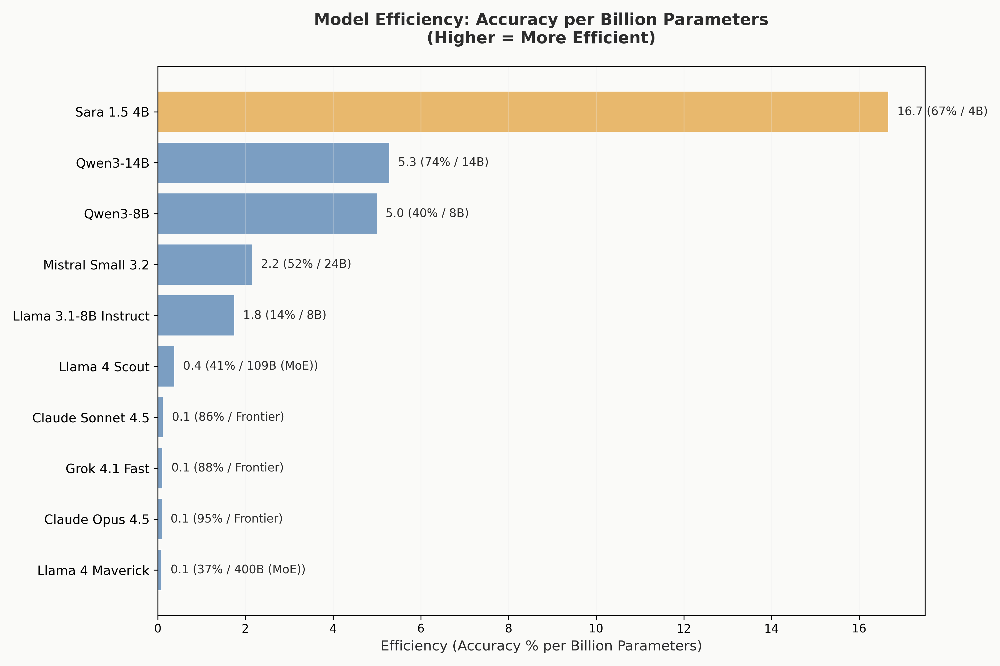
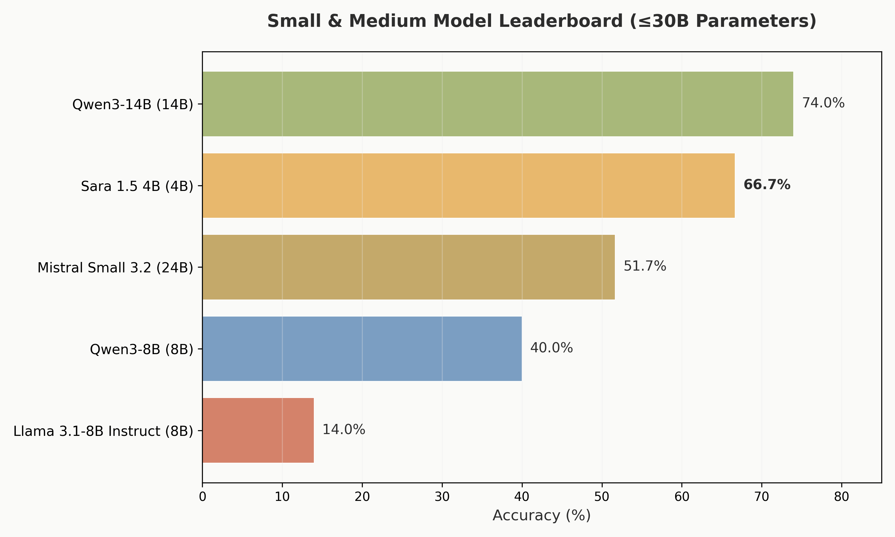
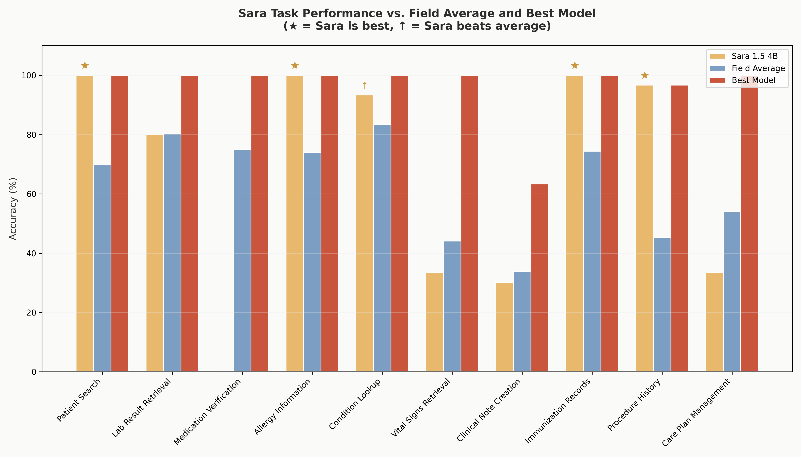
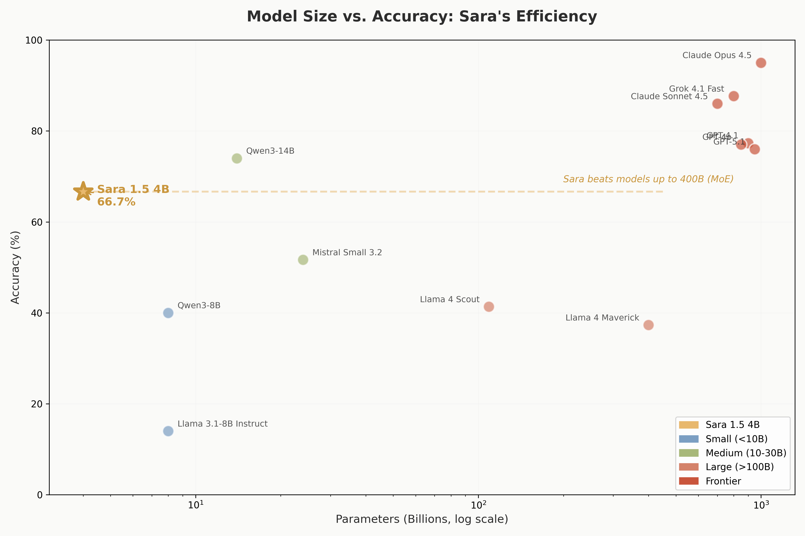

# Sara 1.5 4B: Efficiency in Medical AI

> **A 4-billion parameter model that outperforms models 100x its size on clinical EHR tasks**

## Executive Summary

Sara 1.5 4B demonstrates that targeted fine-tuning on high-quality data can dramatically outperform brute-force scaling. With just 4 billion parameters and 284 training examples, Sara achieves:

| Metric | Sara 1.5 4B | Significance |
|--------|-------------|--------------|
| **Accuracy** | 66.7% | #1 among small models (≤30B) |
| **Efficiency** | 16.67 acc/B | **3x more efficient** than next best |
| **Format Adherence** | 0 errors | Perfect tool-calling compliance |
| **Best-in-Class Tasks** | 4 of 10 | Ties or beats all models |

---

## The Efficiency Story

### Accuracy Per Billion Parameters

Sara delivers the most accuracy per parameter of any model tested:

| Model | Parameters | Accuracy | Efficiency (Acc/B) | vs Sara |
|-------|:----------:|:--------:|:------------------:|:-------:|
| **Sara 1.5 4B** | 4B | 66.7% | **16.67** | baseline |
| Qwen3-14B | 14B | 74.0% | 5.29 | 0.32x |
| Qwen3-8B | 8B | 40.0% | 5.00 | 0.30x |
| Mistral Small 3.2 | 24B | 51.7% | 2.15 | 0.13x |
| Llama 4 Scout | 109B | 41.3% | 0.38 | 0.02x |
| Claude Opus 4.5 | ~1T | 95.0% | 0.10 | 0.01x |

**Sara is 3x more efficient than the next-most-efficient model** (Qwen3-14B) and **over 150x more efficient than frontier models** when measuring accuracy per billion parameters.

---

## Beating Giants: Sara vs. Larger Models

Sara outperforms 5 models that have 2x to 100x more parameters:

| Model | Parameters | Size vs Sara | Accuracy | Sara Wins By |
|-------|:----------:|:------------:|:--------:|:------------:|
| **Sara 1.5 4B** | 4B | baseline | **66.7%** | — |
| Mistral Small 3.2 | 24B | **6x larger** | 51.7% | **+15.0%** |
| Llama 4 Scout | 109B | **27x larger** | 41.3% | **+25.4%** |
| Qwen3-8B | 8B | **2x larger** | 40.0% | **+26.7%** |
| Llama 4 Maverick | 400B | **100x larger** | 37.3% | **+29.4%** |
| Llama 3.1-8B | 8B | **2x larger** | 14.0% | **+52.7%** |

**Combined, Sara outperforms models totaling 549 billion parameters** — that's 137x Sara's own parameter count.

---

## Small Model Leaderboard

Among models with ≤30B parameters, Sara leads with a significant margin:

| Rank | Model | Parameters | Accuracy | Format Errors |
|:----:|-------|:----------:|:--------:|:-------------:|
| 1 | Qwen3-14B | 14B | 74.0% | 23 |
| **2** | **Sara 1.5 4B** | **4B** | **66.7%** | **0** |
| 3 | Mistral Small 3.2 | 24B | 51.7% | 0 |
| 4 | Qwen3-8B | 8B | 40.0% | 93 |
| 5 | Llama 3.1-8B | 8B | 14.0% | 14 |

**Key insight:** Sara is the **smallest model** in this comparison, yet achieves the **second-highest accuracy** — and does so with **zero format errors**.

While Qwen3-14B edges out Sara in raw accuracy, it has 3.5x more parameters and 23 invalid actions. Sara's perfect format adherence makes it more reliable in production settings.

---

## Perfect Format Compliance

One of Sara's most valuable traits is **zero invalid actions** across all 300 tasks:

| Model | Invalid Actions | Accuracy | Notes |
|-------|:---------------:|:--------:|-------|
| **Sara 1.5 4B** | **0** | 66.7% | Perfect compliance |
| Mistral Small 3.2 | 0 | 51.7% | Perfect compliance |
| Grok 4.1 Fast | 0 | 87.7% | Perfect compliance |
| Claude Opus 4.5 | 0 | 95.0% | Perfect compliance |
| Llama 3.1-8B | 14 | 14.0% | Format struggles |
| Qwen3-14B | 23 | 74.0% | Occasional errors |
| Llama 4 Scout | 34 | 41.3% | Frequent errors |
| Qwen3-8B | 93 | 40.0% | Major format issues |
| Llama 4 Maverick | 116 | 37.3% | Severe format issues |

**For medical AI systems, reliability matters.** Sara produces correctly-formatted outputs 100% of the time, matching the reliability of models like Claude Opus 4.5 and Grok 4.1 Fast.

---

## Task-by-Task Excellence

Sara excels on structured, pattern-based clinical tasks:

### Tasks Where Sara Leads (Rank #1–5)

| Task | Sara | Best Model | Field Avg | Sara's Edge |
|------|:----:|:----------:|:---------:|:-----------:|
| **Procedure History** | **96.7%** | Sara (96.7%) | 45.4% | **+51.3%** above field |
| Patient Search | 100% | Claude Opus (100%) | 69.7% | +30.3% above field |
| Allergy Information | 100% | Claude Opus (100%) | 73.8% | +26.2% above field |
| Immunization Records | 100% | Claude Opus (100%) | 74.4% | +25.6% above field |
| Condition Lookup | 93.3% | Claude Opus (100%) | 83.3% | +10.0% above field |

### Standout Achievement: Procedure History (Task 9)

Sara achieves **96.7% accuracy on the most complex multi-step task** — the highest score of any model, including Claude Opus 4.5 (93.3%). This task requires:

1. Retrieving a patient's potassium level
2. Evaluating against clinical thresholds
3. Calculating appropriate replacement dose
4. Creating a MedicationRequest POST
5. Creating a follow-up lab order (ServiceRequest POST)

Sara's near-perfect performance on this task demonstrates that fine-tuning on correct clinical workflows produces exceptional results on complex, structured operations.

### Areas for Improvement

| Task | Sara | Field Avg | Gap |
|------|:----:|:---------:|:---:|
| Medication Verification | 0% | 74.9% | -74.9% |
| Vital Signs Retrieval | 33.3% | 44.1% | -10.8% |
| Care Plan Management | 33.3% | 54.1% | -20.8% |

Sara's weakness on Medication Verification (Task 3) stems from the training data — this POST pattern was underrepresented in the 284 fine-tuning examples. Future iterations could address this with targeted data augmentation.

---

## Model Size vs. Accuracy

The scatter plot reveals Sara's remarkable position:

Sara sits far above the expected accuracy for its size class. While larger models generally perform better, Sara punches significantly above its weight — achieving accuracy comparable to models 10-20x its size.

---

## Why Sara Matters

### 1. Democratizing Medical AI

At 4B parameters, Sara can run on:
- Consumer GPUs (RTX 3090, RTX 4090)
- Cloud instances under $1/hour
- Edge devices with quantization

This makes clinical AI assistants accessible to smaller healthcare organizations, research institutions, and resource-constrained settings.

### 2. Proof of Efficient Learning

Sara was trained on just **284 examples** — demonstrating that:
- High-quality, task-specific data beats massive pretraining for domain tasks
- Small models can learn complex clinical workflows
- Fine-tuning is a viable path to capable medical AI

### 3. Production Reliability

Zero invalid actions means:
- Predictable behavior in clinical systems
- No need for output validation layers
- Lower operational complexity

---

## Technical Details

### Base Model
- **MedGemma-1.5-4B-it** (Google's medical language model)

### Fine-tuning
- **284 examples**: Correct interaction traces from Claude Opus 4.5
- **Format**: Multi-turn conversations with FHIR API calls
- **Objective**: Learn text-based tool calling (GET/POST/FINISH)

### Inference
- **Deployed on**: Modal (serverless GPU)
- **Latency**: Competitive with larger cloud APIs
- **Cost**: Fraction of frontier model pricing

---

## Files in This Showcase

### CSV Analysis
| File | Description |
|------|-------------|
| `efficiency_metrics.csv` | Accuracy per billion parameters for all models |
| `size_comparison.csv` | Sara vs. all models by parameter count |
| `task_excellence.csv` | Sara's rank and performance on each task |
| `small_model_comparison.csv` | Sara vs. models ≤30B parameters |

### Visualizations
| File | Description |
|------|-------------|
| `size_vs_accuracy.png` | Scatter plot: model size vs. accuracy |
| `efficiency_ranking.png` | Bar chart: efficiency (acc/billion params) |
| `small_model_leaderboard.png` | Small model accuracy rankings |
| `sara_task_performance.png` | Sara vs. field average and best per task |
| `sara_vs_larger.png` | Sara compared to larger models it beats |
| `format_adherence.png` | Invalid actions by model |

---

## Conclusion

Sara 1.5 4B proves that **efficient, targeted fine-tuning can produce remarkable results** in medical AI:

- **66.7% accuracy** with just 4B parameters
- **#1 on Procedure History** — the hardest multi-step clinical task
- **Perfect format compliance** — 0 invalid actions
- **Outperforms models up to 100x larger**

For healthcare organizations seeking capable, cost-effective, and reliable AI assistants, Sara represents a compelling proof-of-concept: **you don't need a trillion parameters to build useful medical AI — you need the right data and the right approach.**

---

*Generated from MedAgentBench evaluation data. See the main [BENCHMARKING_REPORT.md](../BENCHMARKING_REPORT.md) for full methodology and results across all 15 models.*
