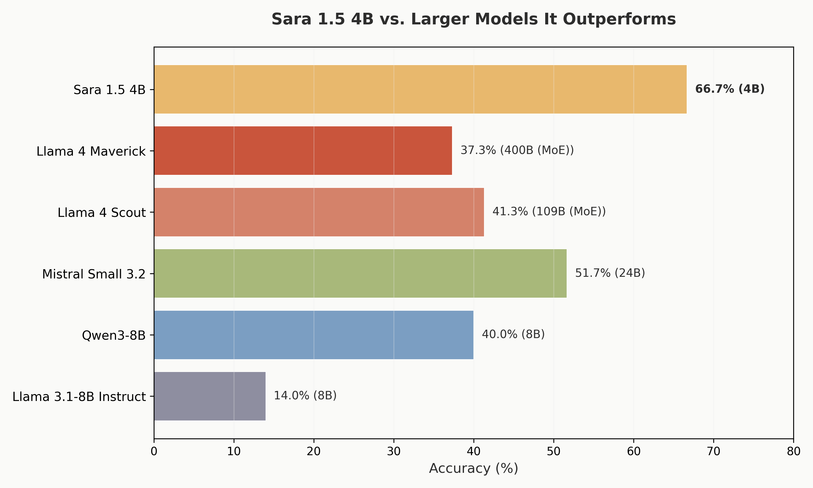

# Sara

**A clinical workflow agent for physicians**

[](https://huggingface.co/Nadhari/Sara-1.5-4B-it)
[](https://huggingface.co/datasets/Nadhari/MedToolCalling)
[](https://sara.nadhari.ai/)
[](https://www.kaggle.com/competitions/med-gemma-impact-challenge/writeups/sara)
[](https://youtube.com)

Sara is a 4-billion parameter clinical workflow agent capable of orchestrating end-to-end digital clinical tasks. Built on [MedGemma](https://huggingface.co/google/medgemma-1.5-4b-it) and fine-tuned on just 284 examples, Sara outperforms models up to 100x its size on the [MedAgentBench](https://ai.nejm.org/doi/full/10.1056/AIdbp2500144) clinical benchmark.

## What Sara Can Do

Sara executes multi-step clinical workflows against a FHIR R4 server through autonomous GET/POST operations:

- **Patient lookup** — search by name, DOB, MRN
- **Lab result retrieval** — magnesium, potassium, HbA1c, glucose
- **Vital signs recording** — blood pressure, CBG
- **Medication ordering** — IV replacements with dosing calculations
- **Referrals & service requests** — orthopedic surgery, follow-up labs
- **Care plan management** — conditional check-and-order workflows

Each task runs as a multi-turn agent loop: Sara reasons about what FHIR call to make, executes it, reads the result, and decides the next step — up to 8 rounds per task.

## Architecture

### Platform


Three serverless services on [Modal](https://modal.com):

| Service | Compute | Role |
|---------|---------|------|
| Sara Model | A100 GPU | Serves Sara 1.5 4B via OpenAI-compatible API |
| Sara Agent | CPU | Orchestrates agent loop, streams SSE to frontend |
| FHIR Server | CPU | HAPI FHIR R4 with 100 synthetic patients (700K+ records) |

The frontend is a Next.js app deployed on Vercel at [sara.nadhari.ai](https://sara.nadhari.ai/).

### Agent Workflow


The agent receives a clinical task, builds a prompt with FHIR function definitions, and enters a loop: call the model, parse the response (GET / POST / FINISH), execute against the FHIR server, feed the result back, and repeat until the task is complete. All steps are streamed to the frontend in real time via Server-Sent Events.

## Fine-Tuning

| | |
|---|---|
| **Base model** | [google/medgemma-1.5-4b-it](https://huggingface.co/google/medgemma-1.5-4b-it) |
| **Dataset** | [Nadhari/MedToolCalling](https://huggingface.co/datasets/Nadhari/MedToolCalling) (284 samples) |
| **Method** | QLoRA — 4-bit NF4, LoRA r=16 α=32 |
| **Trainer** | SFTTrainer (TRL) with custom Gemma 3 collator for loss masking |
| **Hardware** | NVIDIA H100 80GB, Flash Attention 2 |
| **Output** | [Nadhari/Sara-1.5-4B-it](https://huggingface.co/Nadhari/Sara-1.5-4B-it) |

See [`Notebooks/`](Notebooks/) for the full fine-tuning and inference notebooks.

## Benchmarking

Evaluated on 300 clinical tasks across 10 task types using the [MedAgentBench](https://ai.nejm.org/doi/full/10.1056/AIdbp2500144) protocol (pass@1, 8 rounds max, 15 models).

Sara achieves **state-of-the-art** on 4 tasks (Procedure History at 96.7%, and perfect scores on Patient Search, Allergy Information, and Immunization Records) and has **zero invalid actions** across all 300 tasks.



See [`MedAgentBench/`](MedAgentBench/) for full results, per-task breakdowns, and the benchmarking script.

## Repository Structure

```
Sara/
├── README.md
├── requirements.txt
├── Sara_platform.png
├── Sara_agent_workflow.png
│
├── MedAgentBench/                  # Benchmarking
│   ├── benchmark_models.py         # Run benchmarks on any OpenAI-compatible API
│   └── outputs/benchmarks/         # Results for 15 models, CSVs, plots
│
├── Notebooks/                      # Fine-tuning & inference
│   ├── Sara.ipynb                  # QLoRA fine-tuning notebook
│   └── Sara_Inference.ipynb        # Inference & demo notebook
│
└── src/
    ├── backend/                    # Modal-deployed Python services
    │   ├── sara_agent.py           # Agent API (FastAPI + SSE)
    │   ├── sara_model.py           # LLM serving (A100 GPU)
    │   ├── fhir_server.py          # HAPI FHIR R4 server
    │   ├── agent.py                # Agent core logic
    │   ├── Dockerfile.fhir         # FHIR server Docker image
    │   └── utils/                  # Action parser, FHIR client
    │
    └── frontend/                   # Next.js clinical UI (Vercel)
        ├── src/app/                # Pages (landing, chat)
        ├── src/components/         # Chat, artifacts, landing, UI
        ├── src/hooks/              # useChat, useStreaming
        └── src/lib/                # API client, task definitions
```

## Getting Started

### Prerequisites

- Python 3.9+
- [Modal](https://modal.com) account (backend deployment)
- [Docker](https://www.docker.com/) (local FHIR server)
- Node.js 18+ (frontend)

### Backend

```bash
git clone https://github.com/Alfaxad/Sara.git
cd Sara
pip install -r requirements.txt

# Deploy all three services to Modal
modal deploy src/backend/sara_model.py
modal deploy src/backend/fhir_server.py
modal deploy src/backend/sara_agent.py
```

### Frontend

```bash
cd src/frontend
npm install
cp .env.example .env.local
# Edit .env.local with your Modal endpoint URL
npm run dev
```

### Environment Variables

| Variable | Where | Description |
|----------|-------|-------------|
| `NEXT_PUBLIC_MODAL_URL` | Frontend | Sara Agent API URL |
| `SARA_URL` | Modal (sara_agent) | Sara Model endpoint |
| `FHIR_URL` | Modal (sara_agent) | FHIR Server endpoint |
| `HF_TOKEN` | Modal (sara_model) | HuggingFace token for model access |

## Disclaimer

This project is for illustrative purposes only and does not represent a finished or approved product. It is not representative of compliance to any regulations or standards for quality, safety or efficacy. Any real-world application would require additional development, training, and adaptation. The experience highlighted in this demo shows Sara's capability for the displayed task and is intended to help developers and users explore possible applications and inspire further development. Demo data obtained from MedAgentBench.

## Citation

```bibtex
@article{jiang2025medagentbench,
  title={MedAgentBench: A Virtual EHR Environment to Benchmark Medical LLM Agents},
  author={Jiang, Yixing and Black, Kameron C and Geng, Gloria and Park, Danny
          and Zou, James and Ng, Andrew Y and Chen, Jonathan H},
  journal={NEJM AI},
  pages={AIdbp2500144},
  year={2025},
  publisher={Massachusetts Medical Society}
}
```
