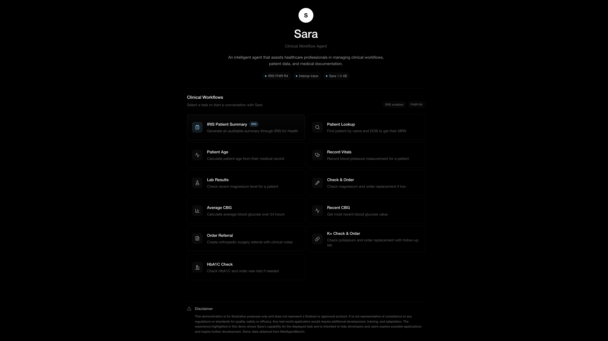
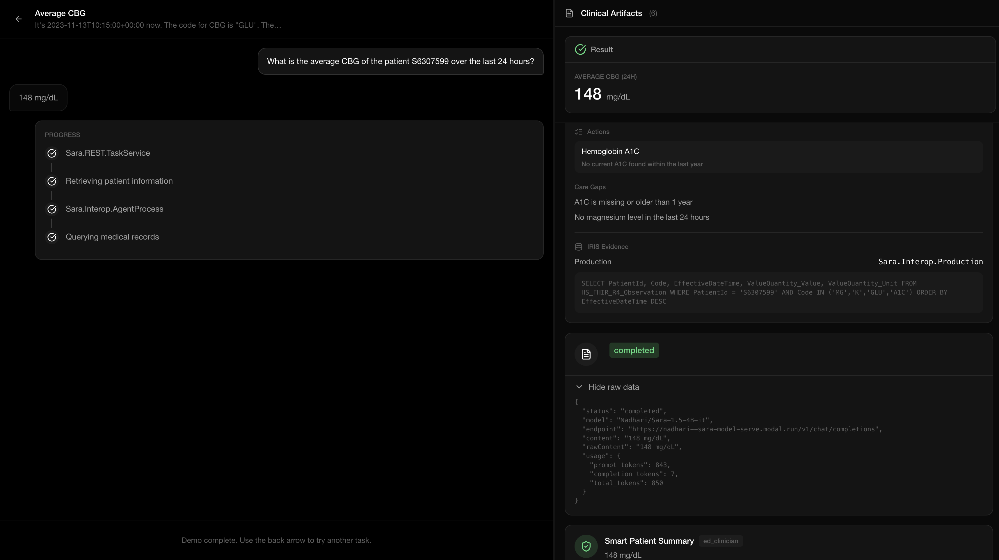
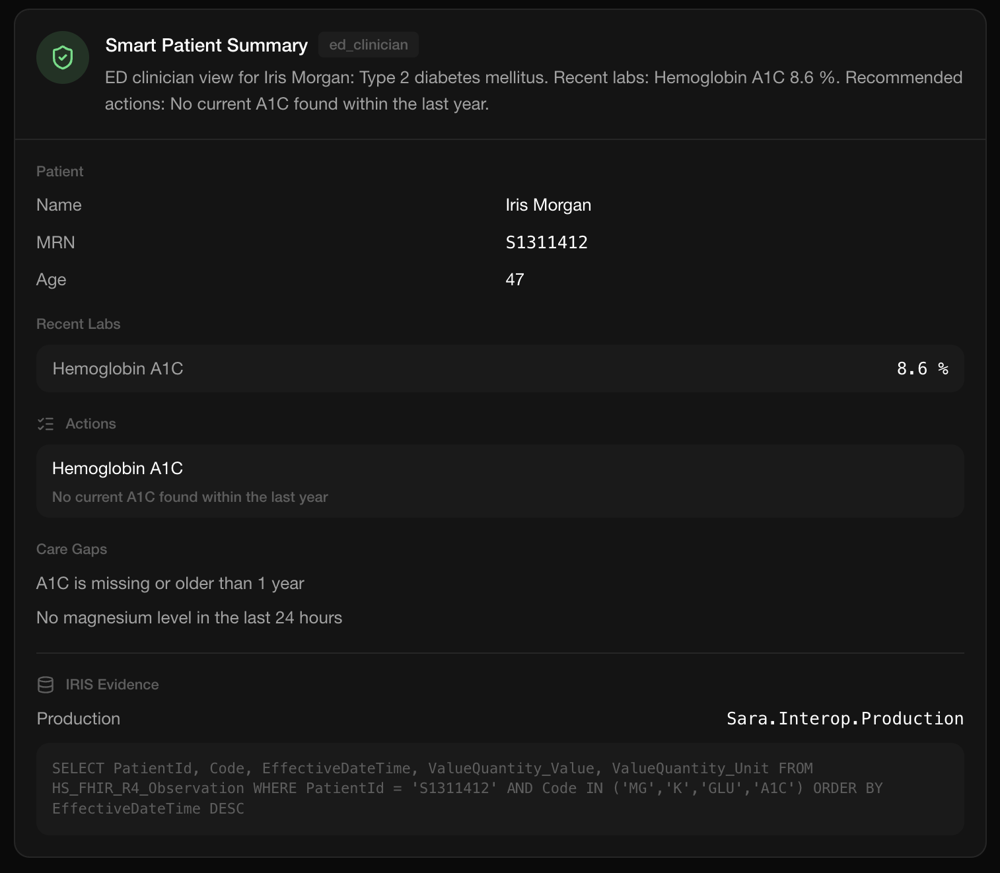
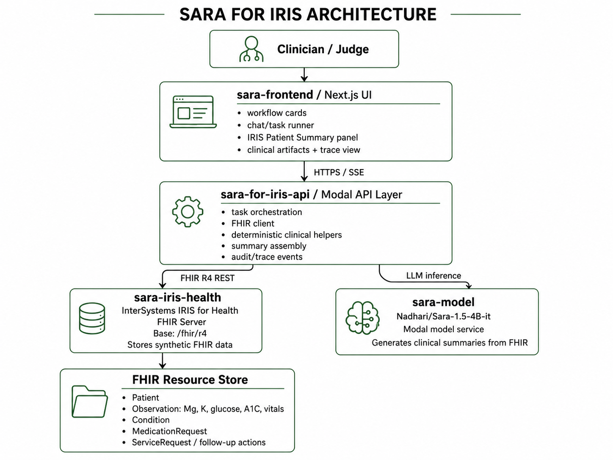
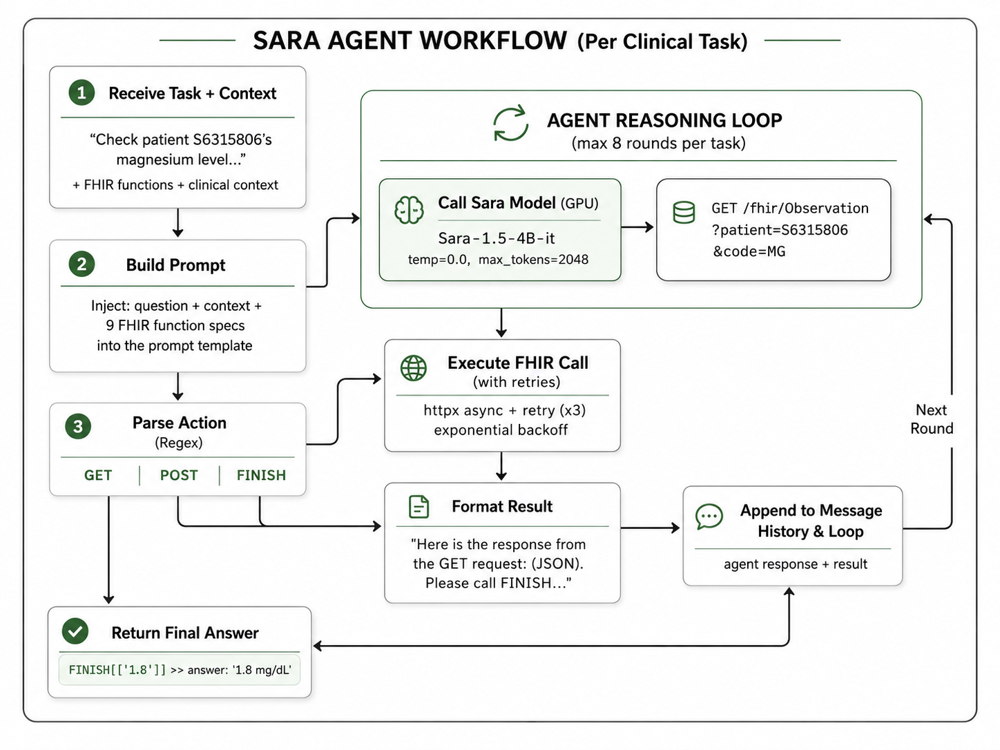
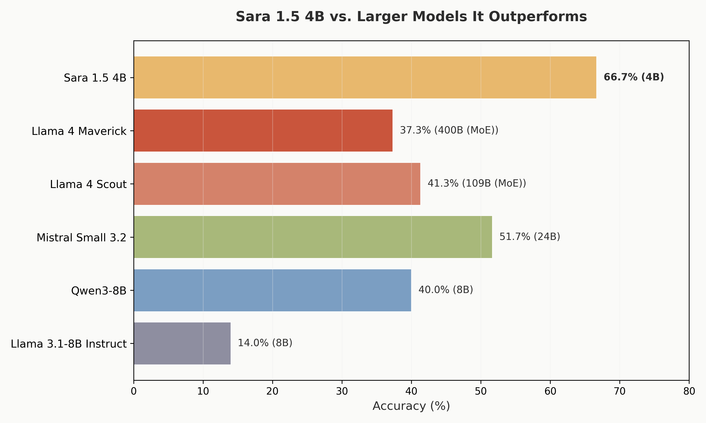
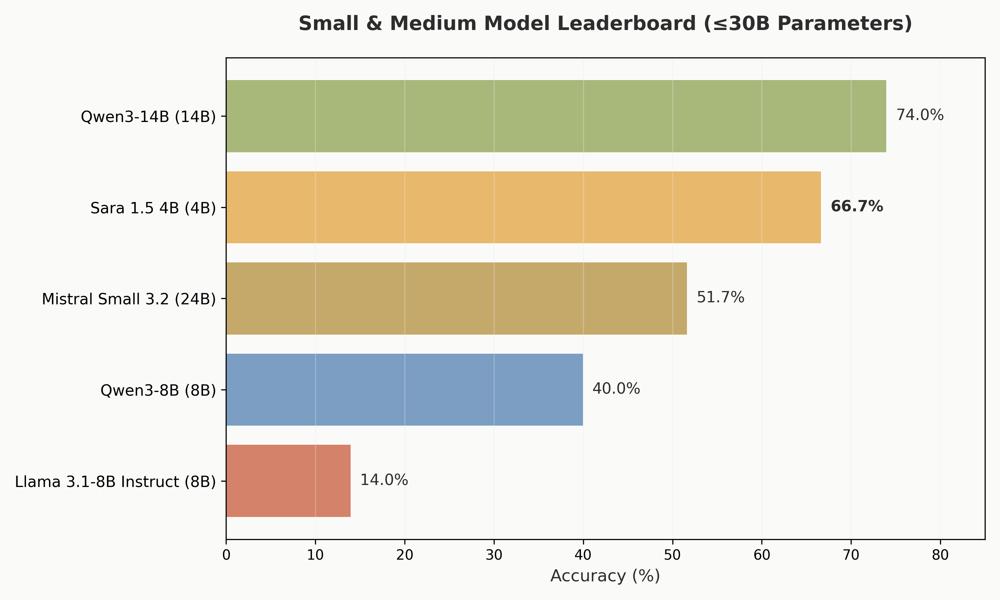

# Sara

**A clinical workflow agent for physicians, upgraded for InterSystems IRIS for Health FHIR systems.**

[](https://huggingface.co/Nadhari/Sara-1.5-4B-it)
[](https://huggingface.co/datasets/Nadhari/MedToolCalling)
[](https://nadhari.ai/sara)
[](https://youtu.be/UAjI9O848wU?si=Gfm0aiaPbxqmB1Fy)

Sara is a 4-billion parameter clinical workflow agent capable of orchestrating end-to-end digital clinical tasks. Built on [MedGemma](https://huggingface.co/google/medgemma-1.5-4b-it) and fine-tuned on 284 examples, Sara performs medical tool calling against FHIR resources, reads patient data, creates clinical actions, and returns concise clinical answers.

This repository includes **Sara for IRIS**, an InterSystems contest edition that runs Sara against **InterSystems IRIS for Health**. It deploys an IRIS for Health FHIR R4 server, loads synthetic FHIR resources, routes summary requests through an Interoperability production, runs deterministic clinical helper logic through Embedded Python, and calls the Sara model for final LLM inference.

Video walkthrough: [https://youtu.be/UAjI9O848wU?si=Gfm0aiaPbxqmB1Fy](https://youtu.be/UAjI9O848wU?si=Gfm0aiaPbxqmB1Fy)

> The Modal deployment is intentionally not treated as a permanent public demo link because GPU and IRIS containers can incur cost. The instructions below show how one can clone, deploy, test, and stop the full stack in their own Modal workspace.

## Screenshots

### Workflow launcher



### IRIS Patient Summary workflow



### Clinical artifacts and trace detail



## What Sara Can Do

Sara executes multi-step clinical workflows against a FHIR R4 server through tool-style GET/POST operations:

- **Patient lookup**: search by name, DOB, MRN, or FHIR patient id.
- **Lab result retrieval**: magnesium, potassium, HbA1c, glucose, and recent-window logic.
- **Vital signs recording**: blood pressure and other Observation resources.
- **Medication ordering**: replacement orders with deterministic dosing calculations.
- **Referrals and service requests**: orthopedic surgery referrals and follow-up labs.
- **Care gap detection**: missing or stale labs such as A1C.
- **Patient summary generation**: role-specific summaries for ED clinicians, care managers, and patients.


## Sara for IRIS

Sara for IRIS is the competition-focused platform in this repository. It is designed to make InterSystems IRIS for Health visible in both the runtime and the UI.

Implemented InterSystems features:

- **InterSystems IRIS for Health FHIR R4 server** at `/fhir/r4`.
- **FHIR Resource Repository** populated with synthetic patient resources.
- **Interoperability production** named `Sara.Interop.Production`.
- **REST business service** for task requests.
- **Embedded Python business process** for deterministic summary generation.
- **FHIR SQL Builder-style evidence** included in the returned artifact.
- **ZPM/IPM package metadata** in `module.xml`.
- **Docker/Modal/native setup paths** for reviewers.


## Architecture

### Platform Architecture



Sara for IRIS is split into four deployable services:

| Service | Modal app | Role |
|---|---|---|
| Frontend | `sara-frontend` | Next.js UI for workflows, chat, FHIR artifacts, summaries, and traces |
| Sara API | `sara-for-iris` | FastAPI/SSE orchestration layer for frontend requests |
| IRIS FHIR Server | `sara-iris-health` | InterSystems IRIS for Health Community 2026.1 FHIR R4 server and Interoperability production |
| Sara Model | `sara-model` | OpenAI-compatible inference endpoint for `Nadhari/Sara-1.5-4B-it` |

Why Modal:

- It lets the IRIS container, FastAPI agent layer, Next.js frontend, and GPU model endpoint live in one reproducible deployment workflow.
- It provides persistent volumes for IRIS data and Hugging Face model cache.
- It supports GPU inference for Sara while keeping the rest of the stack on CPU.

### Agent Workflow



Runtime flow:

1. A user selects `IRIS Patient Summary` in the frontend.
2. The frontend calls the Sara API through `/api/run` or `/api/summary`.
3. The Sara API reads FHIR resources from the IRIS FHIR endpoint.
4. IRIS serves the resources from `/fhir/r4` and exposes Interoperability trace evidence.
5. Deterministic clinical helpers calculate age, latest labs, 24-hour averages, replacement dosing, and stale lab follow-up.
6. The API calls the Sara model endpoint for final LLM wording.
7. The frontend displays the final answer plus FHIR resources, trace events, SQL evidence, and clinical artifacts.

## Repository Structure

```text
Sara/
├── README.md
├── README_OPEN_EXCHANGE.md           # Open Exchange submission draft
├── module.xml                        # ZPM/IPM package metadata for Sara for IRIS
├── docker-compose.iris.yml           # Local IRIS for Health container setup
├── Sara_platform.png                 # Updated platform architecture diagram
├── Sara_agent_workflow.png           # Updated agent workflow diagram
├── sara-scrnsht-0.png                # App screenshot
├── sara-scrnsht-1.png                # App screenshot
├── sara-scrnsht-2.png                # App screenshot
├── requirements.txt                  # Python dependencies for local API/tests
├── requirements-dev.txt              # Additional test dependencies
│
├── data/
│   └── iris-fhir/
│       └── sara-demo-patient-bundle.json
│
├── docs/
│   ├── contest/README.md             # Extra IRIS contest setup notes
│   └── security/                     # Security scan notes
│
├── scripts/
│   ├── generate_iris_demo_bundle.py  # Synthetic FHIR bundle generator
│   └── setup_iris_native.sh          # Native IRIS install helper
│
├── src/
│   ├── backend/
│   │   ├── agent.py                  # Original Sara agent loop
│   │   ├── sara_agent.py             # Original Modal agent API
│   │   ├── sara_iris_agent.py        # Sara for IRIS FastAPI/SSE API
│   │   ├── sara_model.py             # Modal A100 Sara model service
│   │   ├── fhir_server.py            # Legacy HAPI FHIR demo service
│   │   └── utils/
│   │       ├── clinical_tools.py     # Deterministic clinical calculations
│   │       ├── fhir_client.py        # Async FHIR client
│   │       ├── parser.py             # GET/POST/FINISH parser
│   │       └── patient_summary.py    # Smart Patient Summary builder
│   │
│   ├── frontend/
│   │   ├── modal_app.py              # Modal deployment for Next.js app
│   │   ├── package.json
│   │   └── src/
│   │       ├── app/                  # App Router pages
│   │       ├── components/           # Landing, chat, artifact, workflow UI
│   │       ├── hooks/                # Streaming/chat hooks
│   │       └── lib/                  # API client and task definitions
│   │
│   └── iris/
│       ├── modal_iris.py             # Modal-hosted IRIS for Health FHIR server
│       ├── modal-merge.cpf           # IRIS config merge
│       ├── Sara/
│       │   ├── Setup.cls             # Namespace/FHIR/REST/data installer
│       │   ├── Interop/              # Production and AgentProcess classes
│       │   ├── Message/              # TaskRequest, TaskResponse, TraceEvent
│       │   └── REST/                 # TaskService dispatch classes
│       └── python/sara_iris/         # Embedded Python package copied into IRIS
│
├── MedAgentBench/                    # Benchmarking scripts and results
└── Notebooks/                        # Fine-tuning and inference notebooks
```

## Data

The demo data is synthetic FHIR R4 data in `data/iris-fhir/sara-demo-patient-bundle.json`. It includes patients, conditions, observations, medications, and service-request style follow-up actions for the showcased workflows.

The default patient is:

```text
Patient.id: sara-demo-patient
Name: Amina Yusuf
MRN: SARA1001
```

The bundle is loaded into IRIS by:

- `src/iris/Sara/Setup.cls` during ZPM/IPM or native install.
- `src/iris/modal_iris.py` during Modal IRIS deployment.
- `scripts/setup_iris_native.sh` for a local native IRIS install.

## Quick Start: Modal Deployment

These steps deploy the full judge-testable stack in a Modal workspace.

If you are new to Modal, start with the official [Modal guide](https://modal.com/docs/guide) for account setup, CLI authentication, secrets, deployed apps, volumes, and web endpoints.

### 1. Clone the repository

```bash
git clone https://github.com/Alfaxad/Sara.git
cd Sara
```

### 2. Install local tooling

Use Python 3.10 or newer. Modal supports Python 3.10 through 3.14.

```bash
python -m venv .venv
source .venv/bin/activate
python -m pip install --upgrade pip
python -m pip install -r requirements.txt
python -m pip install -r requirements-dev.txt
python -m pip install "modal>=1.0"
```

Install frontend dependencies:

```bash
cd src/frontend
npm ci
cd ../..
```

### 3. Authenticate Modal

```bash
modal setup
```

For CI or headless environments, set only Modal's two auth variables:

```bash
export MODAL_TOKEN_ID=<your-token-id>
export MODAL_TOKEN_SECRET=<your-token-secret>
```

### 4. Create Modal secrets

Create a shared API key for the Sara model service. The Sara API sends this key to the model endpoint.

```bash
modal secret create sara-api-key SARA_API_KEY='<choose-a-long-random-key>'
```

Create a Hugging Face secret if the model download requires authentication. Use a token that can read `Nadhari/Sara-1.5-4B-it`.

```bash
modal secret create huggingface-nadhari HF_TOKEN='<your-huggingface-token>'
```

Create an IRIS password secret. This password is used for the `_SYSTEM` user inside the Modal IRIS container and for API reads against the secured FHIR endpoint.

```bash
modal secret create sara-iris-password \
  IRIS_PASSWORD='<choose-a-long-random-password>' \
  IRIS_FHIR_USERNAME='_SYSTEM' \
  IRIS_FHIR_PASSWORD='<same-password-as-IRIS_PASSWORD>'
```

Optional: protect the Sara API itself by adding `SARA_IRIS_API_KEY` to the same secret. If you already created `sara-iris-password`, update it in the Modal dashboard or delete/recreate it with:

```bash
modal secret create sara-iris-password \
  IRIS_PASSWORD='<choose-a-long-random-password>' \
  IRIS_FHIR_USERNAME='_SYSTEM' \
  IRIS_FHIR_PASSWORD='<same-password-as-IRIS_PASSWORD>' \
  SARA_IRIS_API_KEY='<optional-public-api-key>'
```

If `SARA_IRIS_API_KEY` is set, callers must pass it with either `X-API-Key` or `Authorization: Bearer ...`. The stock frontend is intended for public synthetic-data demos and does not embed this key.

### 5. Pick your Modal workspace slug

Modal endpoint URLs normally look like:

```text
https://<workspace>--<app-name>-<function-name>.modal.run
```

Set your workspace slug before deploying so the API and frontend point to your own Modal URLs:

```bash
export MODAL_WORKSPACE='<your-modal-workspace-slug>'
```

For example, if your Modal web URL is `https://acme--sara-model-serve.modal.run`, your workspace slug is `acme`.

### 6. Deploy IRIS for Health

This pulls the official InterSystems IRIS for Health Community image, creates a persistent Modal volume, starts IRIS, installs Sara's ObjectScript package, stages Embedded Python, loads the synthetic FHIR bundle, and exposes the IRIS web server.

```bash
MODAL_WORKSPACE="$MODAL_WORKSPACE" modal deploy src/iris/modal_iris.py
```

Expected endpoint:

```text
https://<workspace>--sara-iris-health-serve.modal.run/fhir/r4
```

Verify the FHIR server:

```bash
curl -H 'Accept: application/fhir+json' \
  https://<workspace>--sara-iris-health-serve.modal.run/fhir/r4/metadata
```

You should receive a FHIR R4 `CapabilityStatement`.

### 7. Deploy the Sara model

This deploys `Nadhari/Sara-1.5-4B-it` as an OpenAI-compatible `/v1/chat/completions` endpoint on an A100 GPU.

```bash
modal deploy src/backend/sara_model.py
```

Expected endpoint:

```text
https://<workspace>--sara-model-serve.modal.run
```

The first inference call may take longer while the model container starts and downloads or loads cached weights.

### 8. Deploy the Sara for IRIS API

```bash
MODAL_WORKSPACE="$MODAL_WORKSPACE" modal deploy src/backend/sara_iris_agent.py
```

Expected endpoint:

```text
https://<workspace>--sara-for-iris-api.modal.run
```

Health check:

```bash
curl https://<workspace>--sara-for-iris-api.modal.run/health
```

Full summary check:

```bash
curl -X POST https://<workspace>--sara-for-iris-api.modal.run/api/summary \
  -H 'Content-Type: application/json' \
  -d '{"patientId":"sara-demo-patient","role":"ed_clinician","now":"2026-06-06T00:00:00Z"}'
```

A successful response includes:

- `source` pointing to your IRIS FHIR endpoint.
- `patient.name` equal to `Amina Yusuf`.
- `recentLabs` with magnesium, potassium, glucose, and A1C.
- `recommendedActions` with deterministic follow-up actions.
- `modelInference.status` equal to `completed`.

### 9. Deploy the frontend

```bash
MODAL_WORKSPACE="$MODAL_WORKSPACE" modal deploy src/frontend/modal_app.py
```

Expected endpoint:

```text
https://<workspace>--sara-frontend-serve.modal.run
```

Open the frontend and select `IRIS Patient Summary`.

### 10. Stop Modal apps when finished

To avoid unnecessary GPU or IRIS container cost:

```bash
modal app list
modal app stop sara-frontend
modal app stop sara-for-iris
modal app stop sara-model
modal app stop sara-iris-health
```

Depending on your Modal CLI version, `modal app stop` may accept either app names or app IDs from `modal app list`.

## Local Development

### Run the Sara for IRIS API locally

If you already have a reachable IRIS FHIR endpoint:

```bash
export IRIS_FHIR_URL=http://localhost:15273/fhir/r4
export IRIS_FHIR_USERNAME=_SYSTEM
export IRIS_FHIR_PASSWORD='<your-local-iris-password>'
export SARA_MODEL_URL=https://<workspace>--sara-model-serve.modal.run
export SARA_API_KEY='<same-key-used-in-sara-api-key-secret>'

uvicorn src.backend.sara_iris_agent:local_app --reload --port 8000
```

Run the frontend against the local API:

```bash
cd src/frontend
NEXT_PUBLIC_API_URL=http://localhost:8000 npm run dev
```

Open:

```text
http://localhost:3000
```

### Run IRIS with Docker Compose

Use this when you want a local containerized IRIS setup instead of Modal:

```bash
export IRIS_PASSWORD='<replace-with-a-local-dev-password>'
docker compose -f docker-compose.iris.yml up
```

Then configure the API:

```bash
export IRIS_FHIR_URL=http://localhost:52773/fhir/r4
export IRIS_FHIR_USERNAME=_SYSTEM
export IRIS_FHIR_PASSWORD="$IRIS_PASSWORD"
```

### Native IRIS install

If you have InterSystems IRIS for Health installed locally, use:

```bash
export IRIS_USERNAME=_SYSTEM
export IRIS_PASSWORD='<your-local-iris-password>'
scripts/setup_iris_native.sh
```

See [docs/contest/README.md](docs/contest/README.md) for more native IRIS notes.

## Environment Variables

| Variable | Where | Required | Description |
|---|---|---:|---|
| `MODAL_WORKSPACE` | local deploy shell | recommended | Workspace slug used to construct Modal URLs for judges deploying under their own account |
| `MODAL_TOKEN_ID` | local/CI shell | optional | Modal auth token id for headless deploys |
| `MODAL_TOKEN_SECRET` | local/CI shell | optional | Modal auth token secret for headless deploys |
| `SARA_API_KEY` | `sara-api-key` secret | yes | Shared key protecting the Sara model endpoint and used by the Sara API |
| `HF_TOKEN` | `huggingface-nadhari` secret | sometimes | Hugging Face token for model download if access is gated/private |
| `IRIS_PASSWORD` | `sara-iris-password` secret | yes | Password assigned to IRIS `_SYSTEM` user in Modal IRIS |
| `IRIS_FHIR_USERNAME` | `sara-iris-password` secret or local env | yes for secured IRIS | FHIR Basic auth username, normally `_SYSTEM` |
| `IRIS_FHIR_PASSWORD` | `sara-iris-password` secret or local env | yes for secured IRIS | FHIR Basic auth password |
| `IRIS_FHIR_URL` | API runtime/local env | defaulted in Modal | FHIR base URL, usually `https://<workspace>--sara-iris-health-serve.modal.run/fhir/r4` |
| `SARA_MODEL_URL` | API runtime/local env | defaulted in Modal | Sara model endpoint URL |
| `SARA_IRIS_API_KEY` | API runtime secret/env | optional | Protects `/api/*` routes when set |
| `SARA_PUBLIC_RATE_LIMIT_PER_MINUTE` | API runtime env | optional | Default unauthenticated public demo limit is `12` per minute per client |
| `SARA_MODEL_MAX_TOKENS` | API runtime env | optional | Max tokens requested from the Sara model for final summary generation |
| `NEXT_PUBLIC_API_URL` | frontend build env | defaulted in Modal | Browser-visible Sara API URL |

## API Endpoints

Sara API:

```text
GET  /health
GET  /api/tasks
POST /api/summary
POST /api/run
```

IRIS FHIR:

```text
GET /fhir/r4/metadata
GET /fhir/r4/Patient/sara-demo-patient
GET /fhir/r4/Observation?subject=Patient/sara-demo-patient
```

IRIS REST task endpoint:

```text
POST /sara/api/summary
```

Sara model:

```text
GET  /health
GET  /v1/models
POST /v1/chat/completions
```

## Tests and Validation

Run focused backend tests:

```bash
python -m pip install -r requirements-dev.txt
python -m pytest \
  src/backend/test_sara_iris_agent.py \
  src/backend/utils/test_clinical_tools.py \
  src/backend/utils/test_parser.py \
  src/backend/utils/test_fhir_client.py \
  -q
```

Compile changed Python modules:

```bash
python -m py_compile \
  src/backend/sara_iris_agent.py \
  src/backend/sara_model.py \
  src/backend/utils/patient_summary.py \
  src/iris/modal_iris.py \
  src/iris/python/sara_iris/agent.py \
  src/iris/python/sara_iris/summary.py
```

Build the frontend:

```bash
cd src/frontend
npm ci
npm run build
```

Optional security/dependency checks:

```bash
cd src/frontend
npm audit
cd ../..
python -m bandit -r src/backend src/iris scripts -x '*/test_*.py,*/tests/*' -ll
```

## Fine-Tuning

| | |
|---|---|
| **Base model** | [google/medgemma-1.5-4b-it](https://huggingface.co/google/medgemma-1.5-4b-it) |
| **Dataset** | [Nadhari/MedToolCalling](https://huggingface.co/datasets/Nadhari/MedToolCalling) (284 samples) |
| **Method** | QLoRA, 4-bit NF4, LoRA r=16 alpha=32 |
| **Trainer** | SFTTrainer (TRL) with custom Gemma 3 collator for loss masking |
| **Hardware** | NVIDIA H100 80GB, Flash Attention 2 |
| **Output** | [Nadhari/Sara-1.5-4B-it](https://huggingface.co/Nadhari/Sara-1.5-4B-it) |

See [Notebooks/](Notebooks/) for the full fine-tuning and inference notebooks.

## Benchmarking

Evaluated on 300 clinical tasks across 10 task types using the [MedAgentBench](https://ai.nejm.org/doi/full/10.1056/AIdbp2500144) protocol with pass@1, 8 rounds max, and 15 models.

Sara achieves state-of-the-art on 4 tasks, including Procedure History at 96.7 percent and perfect scores on Patient Search, Allergy Information, and Immunization Records. It also has zero invalid actions across all 300 tasks.





See [MedAgentBench/](MedAgentBench/) for full results, per-task breakdowns, and the benchmarking script.

## Open Exchange and Contest Notes

- Open Exchange draft: [README_OPEN_EXCHANGE.md](README_OPEN_EXCHANGE.md)
- Contest setup notes: [docs/contest/README.md](docs/contest/README.md)
- Package metadata: [module.xml](module.xml)
- YouTube video: [https://youtu.be/UAjI9O848wU?si=Gfm0aiaPbxqmB1Fy](https://youtu.be/UAjI9O848wU?si=Gfm0aiaPbxqmB1Fy)

## License

This project is licensed under the MIT License. See [LICENSE](LICENSE).

## Disclaimer

This project is for illustrative purposes only and does not represent a finished or approved product. It is not representative of compliance to any regulations or standards for quality, safety, or efficacy. Any real-world application would require additional development, training, validation, governance, and adaptation. Demo data is synthetic and derived from the MedAgentBench-style workflow examples.

## Citation

```bibtex
@misc{sara-clinical-workflow-agent,
    author = {Alfaxad Eyembe},
    title = {Introducing Sara: A Clinical Workflow Agent},
    year = {2026},
    howpublished = {\url{https://www.kaggle.com/competitions/med-gemma-impact-challenge/writeups/sara}},
    note = {Kaggle}
}
```
